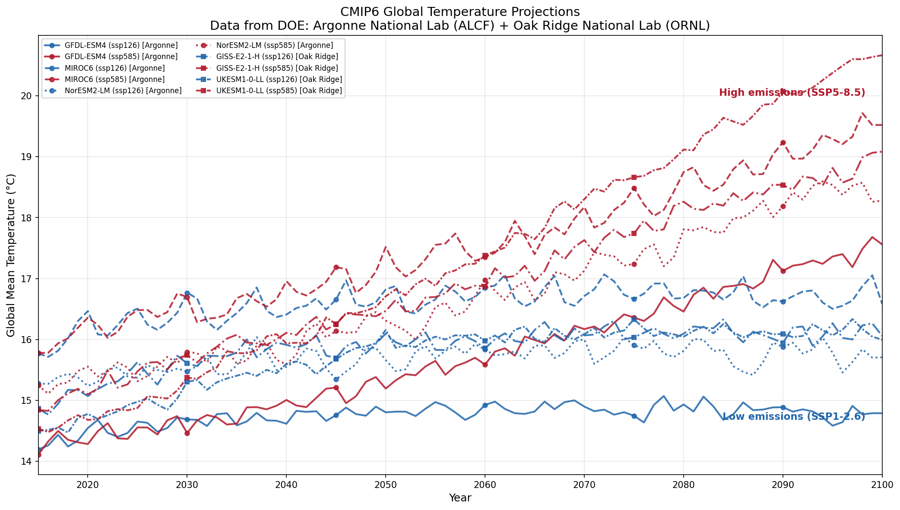
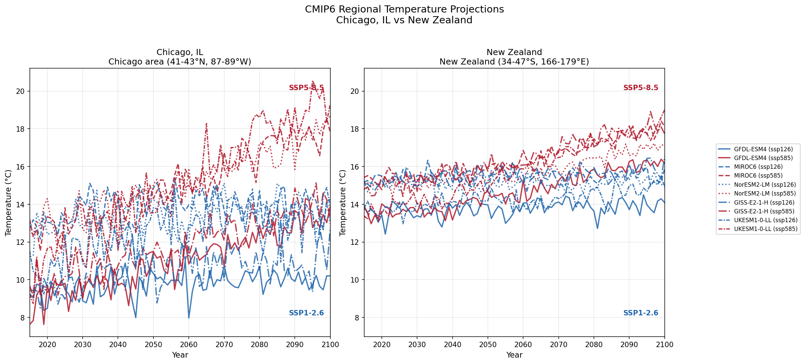
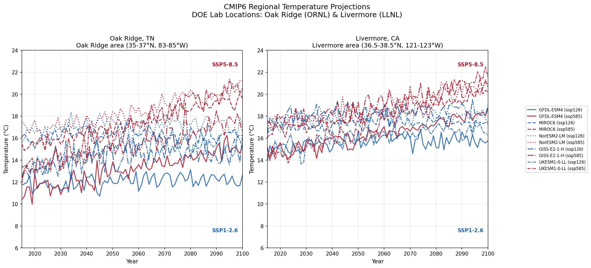
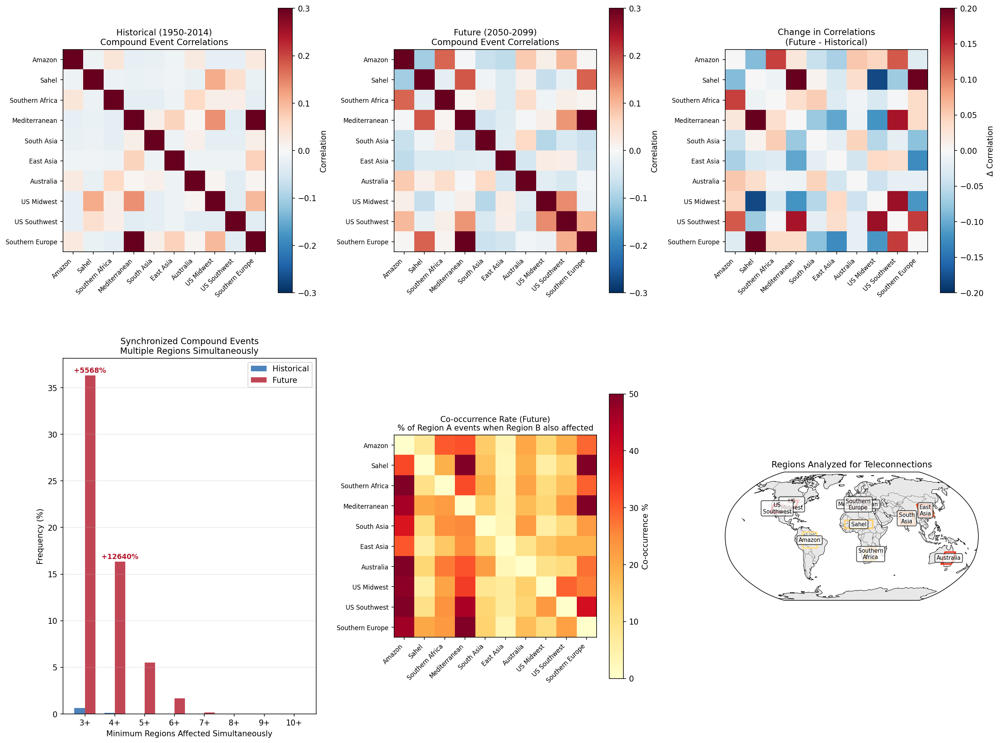
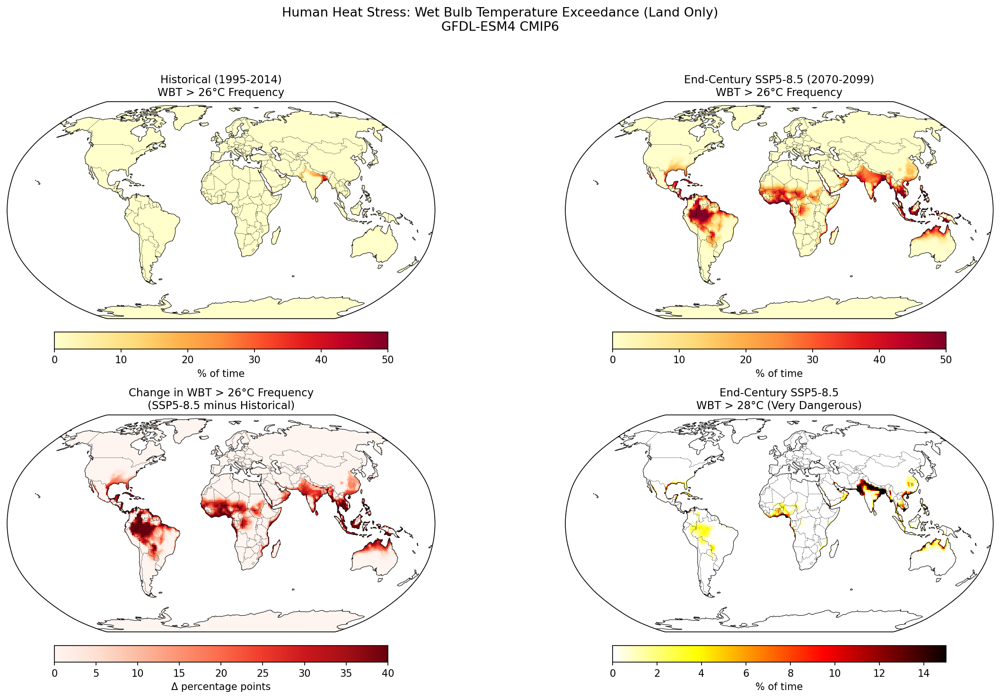

# ESGF + LLM Experiments

I report on experiments that explore the use of a coding agent and Large Language Model (LLM)---Claude + Opus4.5---to discover and analyze climate data from the [**Earth System Grid Federation (ESGF)**](https://esgf.github.io), specifically CMIP6 model output hosted at U.S. Department of Energy data centers.

## Table of Contents

- [Overview](#overview)
- [LLM Model Used](#llm-model-used)
- [Session Queries](#session-queries)
- [Installation](#installation)
- [Project Structure](#project-structure)
- [Analyses Performed](#analyses-performed)
  - [1. Global Temperature Projections](#1-global-temperature-projections)
  - [2. Regional Temperature Analysis](#2-regional-temperature-analysis)
  - [3. GPP (Gross Primary Production) Change](#3-gpp-gross-primary-production-change)
- [ESGF Client Usage](#esgf-client-usage)
- [LLM Interface Usage](#llm-interface-usage)
- [Key Findings](#key-findings)
- [References](#references)
- [Extended Research Studies](#extended-research-studies)
  - [4. Compound Heat-Drought Events](#4-compound-heat-drought-events)
  - [5. Teleconnection Analysis](#5-teleconnection-analysis-synchronized-global-events)
  - [6. Human Heat Stress](#6-human-heat-stress-wet-bulb-temperature)
  - [7. Agricultural Impact](#7-agricultural-impact-winners-and-losers)
- [Summary of All Studies](#summary-of-all-studies)

## Overview

This project demonstrates:
1. **ESGF Search API client** - Programmatic access to CMIP6 climate model data
2. **LLM-powered natural language interface** - Translate plain English queries into ESGF API calls using Claude
3. **Climate analysis examples** - Temperature projections and GPP (vegetation productivity) change analysis

**Data Sources:** Argonne National Lab (ALCF) and Oak Ridge National Lab (ORNL)

This page describes the set up for the experiments; some simple studies that illustrate how the agent+LLM was used to interact with ESGF; and the following four analyses of compound hazards and societal impacts:

| Study | Key Finding | Full Report |
|-------|-------------|-------------|
| **[Compound Heat-Drought Events](#4-compound-heat-drought-events)** | 8-10x increase by 2100; Amazon most vulnerable | [studies/COMPOUND_HAZARD_STUDY.md](studies/COMPOUND_HAZARD_STUDY.md) |
| **[Teleconnection Analysis](#5-teleconnection-analysis-synchronized-global-events)** | 56x increase in synchronized multi-region events | [studies/TELECONNECTION_STUDY.md](studies/TELECONNECTION_STUDY.md) |
| **[Human Heat Stress](#6-human-heat-stress-wet-bulb-temperature)** | 3 billion people face routine dangerous heat | [studies/HEAT_STRESS_STUDY.md](studies/HEAT_STRESS_STUDY.md) |
| **[Agricultural Impact](#7-agricultural-impact-winners-and-losers)** | High-latitude winners, tropical losers | [studies/AGRICULTURAL_IMPACT_STUDY.md](studies/AGRICULTURAL_IMPACT_STUDY.md) |

I am not an expert in climate research; apart from some brief framing, the results presented here are all Claude's work.
Note that all analyses used just monthly, moderate-resolution data.

## LLM Model Used

This project was developed interactively using **Claude Opus 4.5** via [Claude Code](https://claude.com/claude-code), Anthropic's CLI tool for software engineering tasks. The entire workflow—from initial exploration of ESGF data access patterns, through code generation, to analysis and visualization—was driven by natural language conversation with the model.

### Estimated Cost For Studies In this File

| Token Type | Usage (est.) | Rate | Cost |
|------------|--------------|------|------|
| Input | ~250,000 | $15/1M | ~$3.75 |
| Output | ~65,000 | $75/1M | ~$4.88 |
| **Total** | | | **~$8-10** |

The session produced ~2,500 lines of working code, analyzed ~1.8 GB of climate data, and generated publication-ready figures.

The other four studies have a similar size, scope, and cost.

## Session Queries

The following natural language queries drove the analyses in this project.

I started with "**I want to explore the use of LLMs to analyze data maintained by the Earth System Grid Federation. That will 
require you to know what ESGF is; how to access its holdings; and what interesting questions can be used. What do 
you think?**" which led to the generation of some initial code. I followed up with the following. (Not listed are a few "**plot this**" or similar requests plus one to "**consider only datasets at Argonne or Oak Ridge**" [because some other sites were unreliable] and a final "**I want to commit the code that we have written to GitHub with a README that describes it briefly and details the queries performed and the pictures generated.**"). 

| Query | Result |
|-------|--------|
| *"Suggest an example analysis that will access multiple datasets but not be too expensive"* | Global temperature projections comparing 5 CMIP6 models under SSP1-2.6 vs SSP5-8.5 |
| *"I want to repeat the analysis but focusing just on Chicago and New Zealand"* | Regional temperature comparison between Northern and Southern Hemisphere locations |
| *"Repeat for Oak Ridge and Livermore"* | Temperature projections at DOE national lab locations |
| *"Same y-axis range for both graphs"* | Consistent 6-24°C scale across all 4 regional plots |
| *"How will GPP change in the future compared to now, using CESM2 and ssp585?"* | GPP change analysis showing +44% global increase, +99% in Arctic |
| *"Can you create global maps for them?"* | Regional GPP maps by climate zone |
| *"Create a table of all CMIP6 run datasets that are at Argonne and ORNL"* | `Artifacts/doe_cmip6_holdings.json` inventory (~11.6M datasets) |

## Installation

```bash
pip install -e .
pip install xarray netCDF4 matplotlib requests
```

For the LLM interface (optional):
```bash
pip install anthropic
export ANTHROPIC_API_KEY=your_key
```

## Project Structure

```
ESGF_LLM_Experiments/
├── src/esgf_llm/
│   ├── esgf_client.py      # ESGF Search API client
│   └── llm_interface.py    # Claude-powered natural language interface
├── examples/
│   ├── test_client.py              # Basic ESGF API test
│   ├── run_temperature_doe.py      # Temperature analysis (Argonne)
│   ├── run_temperature_ornl.py     # Temperature analysis (Oak Ridge)
│   ├── plot_combined.py            # Combined 5-model visualization
│   ├── run_regional_analysis.py    # Regional: Oak Ridge vs Livermore
│   ├── run_regional_chicago_nz.py  # Regional: Chicago vs New Zealand
│   ├── run_gpp_analysis.py         # GPP change analysis (CESM2)
│   └── plot_gpp_regions.py         # Regional GPP maps
├── Artifacts/                # Generated figures and data files
└── studies/                  # In-depth research study reports
```

## Analyses Performed

### 1. Global Temperature Projections

**Query:** Compare global mean temperature under low (SSP1-2.6) vs high (SSP5-8.5) emissions scenarios using 5 CMIP6 models from DOE data centers.

**Models analyzed:**
| Model | Institution | Data Source |
|-------|-------------|-------------|
| GFDL-ESM4 | NOAA/GFDL (USA) | Argonne |
| MIROC6 | JAMSTEC (Japan) | Argonne |
| NorESM2-LM | NCC (Norway) | Argonne |
| GISS-E2-1-H | NASA GISS (USA) | Oak Ridge |
| UKESM1-0-LL | UK Met Office | Oak Ridge |

**Scripts:** `run_temperature_doe.py`, `run_temperature_ornl.py`, `plot_combined.py`

**Results:** Warming by 2100 ranges from +3.0°C (GFDL-ESM4) to +5.7°C (UKESM1-0-LL) under SSP5-8.5.



### 2. Regional Temperature Analysis

#### Chicago vs New Zealand

**Query:** Compare temperature projections for Chicago (Northern Hemisphere) vs New Zealand (Southern Hemisphere).

**Scripts:** `run_regional_chicago_nz.py`



#### Oak Ridge vs Livermore

**Query:** Compare temperature projections for Oak Ridge, TN vs Livermore, CA (DOE national lab locations).

**Scripts:** `run_regional_analysis.py`



### 3. GPP (Gross Primary Production) Change

**Query:** How will vegetation productivity (GPP) change by end of century under SSP5-8.5 using CESM2?

**Configuration:**
- Model: CESM2 (r11i1p1f1)
- Variable: GPP (Lmon table)
- Present: 1995-2014
- Future: 2081-2100

**Results:**
| Region | Present | Future | Change |
|--------|---------|--------|--------|
| Global land mean | 2.71 | 3.91 g C m⁻² day⁻¹ | +44% |
| Arctic (>60°N) | 1.60 | 3.18 | +99% |
| Northern mid-lat | 1.85 | 3.01 | +62% |
| Tropics | 4.12 | 5.39 | +31% |
| Southern mid-lat | 2.53 | 4.10 | +62% |

**Scripts:** `run_gpp_analysis.py`, `plot_gpp_regions.py`


## ESGF Client Usage

```python
from esgf_llm import ESGFClient

client = ESGFClient(node="llnl")
results = client.search(
    variable_id="tas",
    experiment_id="ssp585",
    source_id="GFDL-ESM4",
    table_id="Amon",
)
```

## LLM Interface Usage

```python
from esgf_llm import create_assistant

assistant = create_assistant()
response = assistant.search("Find monthly precipitation data from the high emissions scenario")
# Automatically translates to: variable_id="pr", experiment_id="ssp585", table_id="Amon"
```

## Key Findings

1. **DOE Globus HTTPS endpoints are publicly accessible** - No authentication required for direct downloads from Argonne and Oak Ridge

2. **Model spread represents structural uncertainty** - The 3-6°C range in warming projections reflects different climate sensitivities across modeling centers

3. **Arctic greening is dramatic** - GPP nearly doubles at high latitudes due to longer growing seasons

4. **Tropical forests at risk** - Despite global CO₂ fertilization, some tropical regions show GPP decline due to heat/drought stress

## References

- [ESGF Search API](https://esgf.github.io/esgf-user-support/search_api.html)
- [CMIP6 Data Access](https://wcrp-cmip.org/cmip-data-access/)
- [Argonne ALCF](https://www.alcf.anl.gov/)
- [Oak Ridge ORNL](https://www.ornl.gov/)

---

## Extended Research Studies

The following in-depth studies were conducted as follow-up exploration, investigating compound climate hazards and their societal impacts using ~2.5 GB of CMIP6 data. The prompt was simple: **"I now want to operate more broadly to conduct open-ended research with ESGF. Come up with some hypothesis and then work with ESGF data to explore that hypothesis. Something really innovative."** These are four of 10 studies suggested by Claude.

### 4. Compound Heat-Drought Events

**Research Question:** Does climate change disproportionately increase compound heat-drought events?

**Methodology:**
- Define compound events: Temperature > 90th percentile AND precipitation < 10th percentile
- Compare historical (1995-2014) vs end-century (2070-2099)
- Test for non-linear amplification

**Key Findings:**

| Metric | Historical | End-Century | Change |
|--------|------------|-------------|--------|
| Global compound frequency | 1.5% | 13.5% | **+800%** |
| Amazon Basin | 2% | 39% | +37 pp |
| Multi-month (3+) events | 0.02/decade | 0.79/decade | **40x** |

**Scripts:** `run_compound_hazard_analysis.py`, `run_seasonal_compound_analysis.py`, `run_consecutive_events.py`

**Full Study:** [studies/COMPOUND_HAZARD_STUDY.md](studies/COMPOUND_HAZARD_STUDY.md)


---

### 5. Teleconnection Analysis: Synchronized Global Events

**Research Question:** Do compound events in distant regions co-occur, creating cascading global impacts?

**Key Findings:**

| Metric | Historical | End-Century | Change |
|--------|------------|-------------|--------|
| 3+ regions simultaneous | 0.6% | 36.3% | **56x increase** |
| 5+ regions simultaneous | 0% | 5.5% | New phenomenon |

The synchronization explosion is NOT due to stronger teleconnections (correlations remain ~0.02) but purely probabilistic—when each region's risk rises from 2% to 20%, simultaneous events emerge mathematically.

**Implication:** Global food security systems designed for single-region failures will face multi-breadbasket synchronization.

**Scripts:** `run_teleconnection_analysis.py`

**Full Study:** [studies/TELECONNECTION_STUDY.md](studies/TELECONNECTION_STUDY.md)



---

### 6. Human Heat Stress: Wet Bulb Temperature

**Research Question:** How do dangerous heat stress conditions change under climate change?

Wet Bulb Temperature (WBT) combines temperature and humidity—the key metric for human physiological heat tolerance. At WBT = 35°C, the human body cannot cool itself.

**Key Findings:**

| Region | Historical (>26°C) | End-Century | Change |
|--------|-------------------|-------------|--------|
| Global | 0.5% | 17.5% | **35x increase** |
| Southeast Asia | 2.9% | 65.5% | +62.6 pp |
| South Asia (1.9B people) | 5.9% | 39.2% | +33.3 pp |

**Implication:** 3 billion people will live in regions where outdoor work is dangerous more than one-third of the year.

**Scripts:** `run_heat_stress_analysis.py`

**Full Study:** [studies/HEAT_STRESS_STUDY.md](studies/HEAT_STRESS_STUDY.md)



---

### 7. Agricultural Impact: Winners and Losers

**Research Question:** Which agricultural regions gain or lose under climate change?

**Key Findings:**

| Region | GDD Change | Heat Stress | Verdict |
|--------|------------|-------------|---------|
| US Corn Belt | +52% | Near zero | **WINNER** |
| European Breadbasket | +63% | Zero | **WINNER** |
| African Sahel | +21% | Severe heat **14x** | **LOSER** |
| Indo-Gangetic Plain | +22% | Severe heat 2x | **LOSER** |

High-latitude breadbaskets gain growing capacity while tropical regions face catastrophic heat stress that overwhelms any GDD benefits.

**Implication:** Climate change will dramatically widen the gap between agricultural haves and have-nots.

**Scripts:** `run_agricultural_impact.py`

**Full Study:** [studies/AGRICULTURAL_IMPACT_STUDY.md](studies/AGRICULTURAL_IMPACT_STUDY.md)


---

## Summary of All Studies

| Study | Key Finding | Policy Implication |
|-------|-------------|-------------------|
| Compound Hazards | 8-10x increase by 2100 | Multi-hazard planning essential |
| Teleconnections | 56x increase in synchronized events | Global food reserves needed |
| Heat Stress | 3B people face routine dangerous heat | Labor law and urban planning reform |
| Agriculture | Stark winners/losers divide | Food system restructuring required |

**Total Data Analyzed:** ~2.5 GB of CMIP6 model output from DOE data centers
