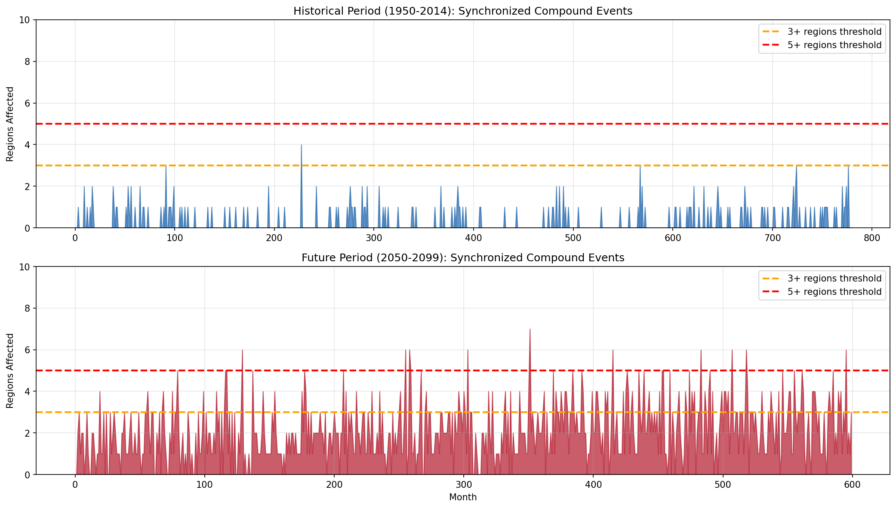

# Teleconnection Analysis: Synchronized Compound Events Across Regions

## Executive Summary

This study investigates whether compound heat-drought events in geographically distant regions tend to co-occur, creating cascading global impacts. Using CMIP6 projections, we analyzed the synchronization of compound events across 10 key agricultural and population centers.

**Key Finding**: Synchronized multi-region compound events (3+ regions simultaneously affected) increase from 0.6% to 36.3% of months by end-century—a **56-fold increase**. This has profound implications for global food security and humanitarian response capacity.

---

## 1. Rationale

### 1.1 Why Teleconnections Matter

When compound heat-drought events strike multiple breadbasket regions simultaneously:
- **Global food prices spike** as multiple suppliers fail together
- **Humanitarian resources are stretched** across multiple crises
- **Trade-based adaptation fails** when import sources are also affected
- **Insurance systems face correlated losses** leading to potential collapse

### 1.2 Research Questions

1. Do compound events in distant regions correlate?
2. How often do multiple regions experience compound events simultaneously?
3. Does climate change increase synchronization of compound events?
4. Which region pairs show the strongest teleconnections?

### 1.3 Hypothesis

**Hypothesis**: Climate change will dramatically increase the frequency of synchronized multi-region compound events, even if inter-regional correlations remain weak, simply because each region individually experiences more compound events.

---

## 2. Methods

### 2.1 Regions Analyzed

We selected 10 globally significant regions for agriculture, population, or ecosystems:

| Region | Coordinates | Significance |
|--------|-------------|--------------|
| Amazon | 20°S-10°N, 80°W-40°W | Carbon sink, biodiversity |
| Sahel | 10°N-20°N, 20°W-40°E | Food security hotspot |
| Mediterranean | 30°N-46°N, 10°W-36°E | European agriculture |
| South Asia | 5°N-35°N, 60°E-100°E | 1.9 billion people |
| East Asia | 20°N-45°N, 100°E-145°E | Major food producer |
| Southern Africa | 35°S-10°S, 10°E-45°E | Regional food security |
| Australia | 45°S-10°S, 110°E-155°E | Wheat exporter |
| US Midwest | 35°N-50°N, 105°W-80°W | Global breadbasket |
| US Southwest | 25°N-42°N, 125°W-100°W | Water stress region |
| Southern Europe | 35°N-50°N, 10°W-30°E | Mediterranean agriculture |

### 2.2 Data

| Parameter | Value |
|-----------|-------|
| Model | GFDL-ESM4 |
| Variables | tas (temperature), pr (precipitation) |
| Historical Period | 1950-2014 |
| Future Period | 2050-2099 (SSP5-8.5) |
| Compound Definition | temp > 90th percentile AND precip < 10th percentile |

### 2.3 Analysis Approach

1. **Regional Time Series**: Calculate monthly compound event occurrence for each region (area-weighted mean of binary compound flag)
2. **Cross-Correlations**: Compute Pearson correlations between all region pairs
3. **Synchronized Events**: Count months where N or more regions simultaneously have compound events (regional fraction > 0.3)

---

## 3. Code

### 3.1 Key Functions

```python
def compute_regional_compound_timeseries(compound_bool, regions):
    """
    Compute time series of compound event fraction for each region.

    Returns dict mapping region name to time series of monthly
    area-weighted fraction of grid cells with compound events.
    """
    regional_ts = {}
    for region_name, bounds in regions.items():
        lat_min, lat_max = bounds["lat"]
        lon_min, lon_max = bounds["lon"]

        # Handle longitude wrapping
        if lon_min < 0:
            lon_min = lon_min + 360
        if lon_max < 0:
            lon_max = lon_max + 360

        region_data = compound_bool.sel(
            lat=slice(lat_min, lat_max),
            lon=slice(lon_min, lon_max)
        )

        # Area-weighted mean
        weights = np.cos(np.deg2rad(region_data.lat))
        regional_mean = region_data.weighted(weights).mean(dim=["lat", "lon"])
        regional_ts[region_name] = regional_mean.values

    return regional_ts

def count_synchronized_events(regional_ts, threshold=0.3, min_regions=3):
    """
    Count months where min_regions or more have compound fraction > threshold.
    """
    n_months = len(list(regional_ts.values())[0])
    sync_counts = {n: 0 for n in range(3, 11)}

    for month_idx in range(n_months):
        regions_affected = sum(
            1 for ts in regional_ts.values()
            if ts[month_idx] > threshold
        )
        for n in sync_counts:
            if regions_affected >= n:
                sync_counts[n] += 1

    return sync_counts
```

### 3.2 Full Analysis Script

The complete analysis is in `examples/run_teleconnection_analysis.py`.

---

## 4. Results

### 4.1 Synchronized Event Frequency

| Synchronization Level | Historical | Future | Change |
|-----------------------|------------|--------|--------|
| 3+ regions simultaneously | 0.6% | 36.3% | **+5,568%** |
| 4+ regions simultaneously | 0.1% | 16.3% | **+16,200%** |
| 5+ regions simultaneously | 0.0% | 5.5% | **New phenomenon** |
| 6+ regions simultaneously | 0.0% | 1.7% | **New phenomenon** |
| 7+ regions simultaneously | 0.0% | 0.2% | **New phenomenon** |

**Key Finding**: Events affecting 5+ regions simultaneously—essentially non-existent in historical climate—occur in 5.5% of future months.


*Figure 1: Cross-correlation matrices (left) and synchronized event frequencies (right) for historical and future periods*

### 4.2 Inter-Regional Correlations

Mean inter-regional correlation:
- Historical: **0.023**
- Future: **0.026**
- Change: **+0.004** (minimal)

**Interpretation**: Regions do NOT become more correlated with each other. The explosion in synchronized events is purely due to each region independently experiencing more compound events.

### 4.3 Top Correlated Region Pairs

| Region Pair | Correlation |
|-------------|-------------|
| Mediterranean ↔ Southern Europe | **+0.847** |
| Sahel ↔ Mediterranean | +0.186 |
| Sahel ↔ Southern Europe | +0.176 |
| Amazon ↔ Southern Africa | +0.174 |
| US Midwest ↔ US Southwest | +0.142 |

The Mediterranean-Southern Europe correlation is expected given geographic overlap. More interesting are the cross-continental correlations (Amazon-Southern Africa, Sahel-Mediterranean).


*Figure 2: Regional compound event time series comparing historical and future variability*

### 4.4 Regional Compound Event Changes

Individual regional compound event frequency changes drive the synchronized event increase:

| Region | Historical | Future | Increase |
|--------|------------|--------|----------|
| Amazon | ~2% | ~40% | **20x** |
| Mediterranean | ~2% | ~25% | **12x** |
| South Asia | ~2% | ~15% | **7x** |
| Sahel | ~2% | ~20% | **10x** |
| Global average | 1.5% | 13.5% | **9x** |

---

## 5. Analysis

### 5.1 Why Synchronization Explodes Despite Weak Correlations

Consider a simple probability calculation:

**Historical Climate**:
- Each region has ~2% compound event probability
- If independent, P(3+ of 10 regions) ≈ 0.1%
- Observed: 0.6% (slight positive correlation boost)

**Future Climate**:
- Each region has ~15-40% compound event probability
- If independent, P(3+ of 10 regions) ≈ 30-40%
- Observed: 36.3%

The synchronization explosion is a **mathematical consequence** of raising each region's individual probability, not increased teleconnections.

### 5.2 Implications for Global Food Security

The "breadbasket synchronization" problem:

1. **Historical**: Multi-breadbasket failures were rare enough to be manageable through trade
2. **Future**: 36% of months will see 3+ major regions in compound conditions simultaneously
3. **Systemic risk**: Global grain reserves could be depleted by multiple consecutive synchronized failures

### 5.3 Cascading Humanitarian Crises

With 5+ regions affected simultaneously in 5.5% of future months:
- Humanitarian organizations cannot respond to multiple simultaneous crises
- Climate migration from multiple regions could synchronize
- International aid systems designed for localized disasters will be overwhelmed

### 5.4 Regional Teleconnection Patterns

The observed correlations suggest physical teleconnection mechanisms:

1. **Mediterranean-Sahel link**: Shared North African weather patterns
2. **Amazon-Southern Africa**: Possible tropical Atlantic SST influence
3. **US Midwest-Southwest**: Continental-scale atmospheric patterns

---

## 6. Conclusions

### 6.1 Hypothesis Evaluation

| Component | Verdict |
|-----------|---------|
| Synchronized events increase dramatically | ✓ **SUPPORTED** (56x increase) |
| Due to stronger teleconnections | ✗ **NOT SUPPORTED** (correlations unchanged) |
| Due to higher individual probabilities | ✓ **SUPPORTED** (mathematical necessity) |

### 6.2 Key Conclusions

1. **Synchronized multi-region compound events will become common**: From 0.6% to 36.3% of months seeing 3+ regions affected.

2. **This is NOT due to stronger teleconnections**: Inter-regional correlations remain near zero. The effect is purely probabilistic—when each region's risk rises from 2% to 20%, synchronized events emerge mathematically.

3. **Novel phenomena emerge**: Events affecting 5-7 regions simultaneously—unprecedented in historical climate—become regular occurrences.

4. **Global food systems face systemic risk**: The assumption that trade can compensate for regional failures breaks down when failures synchronize.

5. **Humanitarian response architecture needs redesign**: Systems designed for single-crisis response cannot handle synchronized multi-region emergencies.

### 6.3 Policy Implications

- **Strategic grain reserves**: Need expansion to buffer synchronized production failures
- **Diversified food trade networks**: Current hub-spoke patterns are vulnerable
- **Multi-hazard early warning systems**: Need to forecast synchronized events
- **Humanitarian pre-positioning**: Resources must be distributed to handle multiple simultaneous crises

---

## 7. Data Files

| File | Description |
|------|-------------|
| `Artifacts/teleconnection_analysis.png` | Correlation matrices and synchronization charts |
| `Artifacts/teleconnection_timeseries.png` | Regional time series comparisons |
| `Artifacts/teleconnection_summary.json` | Numerical results summary |
| `examples/run_teleconnection_analysis.py` | Analysis script |

---

*Analysis conducted using CMIP6 GFDL-ESM4 model output from ESGF.*
