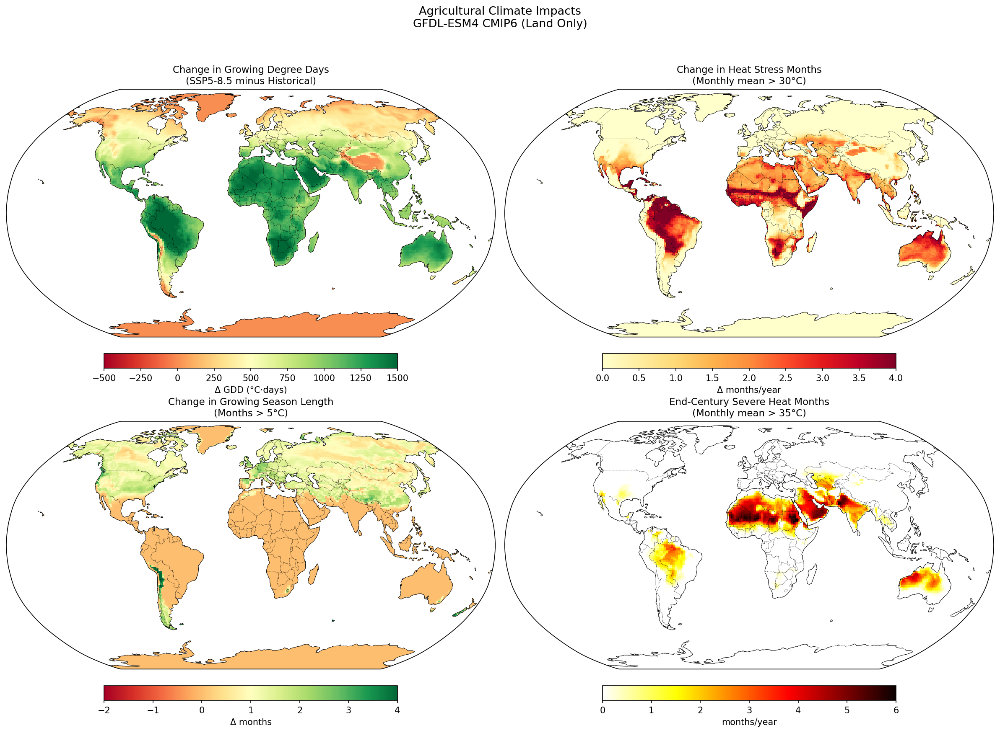
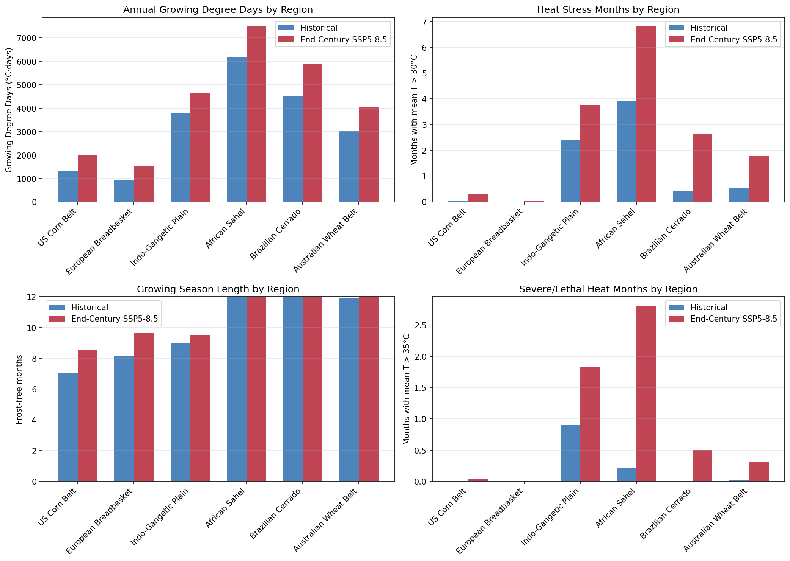

# Agricultural Impact Analysis: Climate Change Effects on Crop Production

## Executive Summary

This study analyzes how climate change affects key agricultural regions using Growing Degree Days (GDD), growing season length, and heat stress metrics. Using CMIP6 projections, we identify agricultural "winners" and "losers" under climate change.

**Key Finding**: Climate change creates stark winners and losers. High-latitude breadbaskets (US, Europe) gain growing capacity without significant heat stress, while tropical/subtropical regions (Sahel, South Asia) face devastating heat stress increases that could overwhelm any GDD benefits.

---

## 1. Background

### 1.1 Agricultural Climate Metrics

| Metric | Definition | Significance |
|--------|------------|--------------|
| **Growing Degree Days (GDD)** | Accumulated heat above base temperature (10°C) | Determines crop development rate and yield potential |
| **Growing Season Length** | Months with mean T > 5°C | Limits which crops can be grown |
| **Heat Stress** | Months with mean T > 30°C | Damages crops, reduces yields |
| **Severe Heat** | Months with mean T > 35°C | Can be lethal to crops |

### 1.2 Research Questions

1. Which agricultural regions gain growing capacity under climate change?
2. Which regions face damaging heat stress?
3. What is the net impact—do GDD gains offset heat stress losses?
4. How do impacts differ between high and low emissions scenarios?

---

## 2. Methods

### 2.1 Agricultural Regions Analyzed

| Region | Location | Key Crops | Global Significance |
|--------|----------|-----------|---------------------|
| US Corn Belt | 35-50°N, 105-80°W | Corn, Soybeans | #1 corn exporter |
| European Breadbasket | 43-55°N, 5°W-30°E | Wheat, Barley | Major wheat producer |
| Indo-Gangetic Plain | 20-35°N, 70-90°E | Rice, Wheat | Feeds 1 billion people |
| African Sahel | 10-18°N, 15°W-35°E | Millet, Sorghum | Food security hotspot |
| Brazilian Cerrado | 30-15°S, 60-45°W | Soybeans, Corn | #1 soy exporter |
| Australian Wheat Belt | 38-28°S, 135-150°E | Wheat | Major wheat exporter |

### 2.2 Data

| Parameter | Value |
|-----------|-------|
| Model | GFDL-ESM4 |
| Variables | tas (temperature), pr (precipitation) |
| Historical Period | 1995-2014 |
| Future Period | 2070-2099 |
| Scenarios | SSP1-2.6, SSP5-8.5 |

### 2.3 Calculations

**Growing Degree Days**:
```
GDD = Σ max(0, T_monthly - 10°C) × 30 days
```

**Heat Stress Months**: Count of months with mean T > 30°C

**Severe Heat Months**: Count of months with mean T > 35°C

---

## 3. Results

### 3.1 Global Changes

| Metric | Historical | End-Century (SSP5-8.5) | Change |
|--------|------------|------------------------|--------|
| Growing Degree Days | 3,036 | 3,701 | **+665 (+22%)** |
| Growing Season | 9.4 months | 9.8 months | +0.4 months |
| Heat Stress Months | 0.22 | 1.20 | **+0.98 (+445%)** |


*Figure 1: Global maps of agricultural climate changes. Top-left: GDD change (green = increase). Top-right: Heat stress increase. Bottom-left: Growing season change. Bottom-right: Severe heat by end-century.*

### 3.2 Regional Results

| Region | GDD Change | Heat Stress Change | Severe Heat Change | Net Impact |
|--------|------------|-------------------|-------------------|------------|
| **US Corn Belt** | +693 (+52%) | +0.3 months | 0 | **WINNER** |
| **European Breadbasket** | +594 (+63%) | 0 | 0 | **WINNER** |
| **Indo-Gangetic Plain** | +850 (+22%) | +1.4 months | +0.9 months | **MIXED** |
| **African Sahel** | +1,310 (+21%) | +2.9 months | +2.6 months | **LOSER** |
| **Brazilian Cerrado** | +1,361 (+30%) | +2.2 months | +0.5 months | **MIXED** |
| **Australian Wheat Belt** | +1,018 (+34%) | +1.3 months | +0.3 months | **MIXED** |


*Figure 2: Regional comparison of agricultural metrics. Note the dramatic increase in heat stress months for the African Sahel.*

### 3.3 Winners: High-Latitude Breadbaskets

**US Corn Belt**:
- GDD increases 52% (1,326 → 2,018)
- Heat stress remains near zero
- Growing season extends by 1.5 months
- **Net effect**: Significantly enhanced growing conditions

**European Breadbasket**:
- GDD increases 63% (942 → 1,537)
- No heat stress emergence
- Growing season extends by 1.7 months
- **Net effect**: Major expansion of viable crop options

### 3.4 Losers: Tropical/Subtropical Regions

**African Sahel**:
- Severe heat: 0.2 → 2.8 months (**14x increase**)
- Heat stress: 3.9 → 6.8 months (57% of year)
- GDD gains are meaningless when crops die from heat
- **Net effect**: Catastrophic for rain-fed agriculture

**Indo-Gangetic Plain**:
- Severe heat nearly doubles (0.9 → 1.8 months)
- Heat stress increases by 58% (2.4 → 3.8 months)
- Threatens rice and wheat yields for 1 billion people
- **Net effect**: Significant yield declines likely

### 3.5 Mixed Outcomes

**Brazilian Cerrado**:
- Large GDD gains (+1,361)
- But heat stress increases substantially (+2.2 months)
- May require shifting to more heat-tolerant varieties
- **Net effect**: Depends on adaptation capacity

**Australian Wheat Belt**:
- Moderate GDD gains (+1,018)
- Heat stress more than triples (+1.3 months)
- Water availability will be the key constraint
- **Net effect**: Challenging without irrigation expansion

---

## 4. Analysis

### 4.1 The Inequality of Climate Change

Climate change will dramatically widen the gap between agricultural haves and have-nots:

**Winners (High-latitude developed nations)**:
- US, Canada, Northern Europe, Russia
- Gain growing capacity
- Have resources to adapt
- May capture market share from struggling regions

**Losers (Tropical/subtropical developing nations)**:
- Sahel, South Asia, Central America
- Face devastating heat stress
- Limited adaptation resources
- Already food-insecure populations

### 4.2 Crop-Specific Implications

| Crop | Key Regions | Impact |
|------|-------------|--------|
| **Wheat** | Europe, US, Australia | Generally positive in high latitudes |
| **Corn** | US, Brazil | US benefits; Brazil faces heat stress |
| **Rice** | South Asia, SE Asia | Severe heat stress threatens yields |
| **Soybeans** | US, Brazil, Argentina | US gains; South America mixed |
| **Millet/Sorghum** | Sahel | Catastrophic heat stress |

### 4.3 Food Security Implications

The regions facing the worst agricultural impacts are also:
- Home to the fastest-growing populations
- Already experiencing food insecurity
- Least able to afford food imports
- Most dependent on rain-fed agriculture

This creates a perfect storm for food crises:
1. Local production declines
2. Import capacity limited
3. Global prices rise as tropical producers fail
4. Climate migration accelerates

### 4.4 Adaptation Options

**For Winners**:
- Expand northward cultivation
- Introduce new crop varieties
- Extend growing seasons

**For Losers**:
- Heat-tolerant crop breeding (limited potential above 35°C)
- Shift planting dates (limited by monsoon timing)
- Irrigation expansion (limited by water availability)
- Diversify to livestock (also heat-stressed)
- Import more food (limited by purchasing power)

---

## 5. Conclusions

### 5.1 Key Findings

1. **Climate change creates agricultural winners and losers**: High-latitude regions gain, tropical regions lose.

2. **The African Sahel faces catastrophic impacts**: Severe heat increases 14x, threatening the food security of hundreds of millions.

3. **South Asia (1 billion people) faces major challenges**: Severe heat nearly doubles during critical growing periods.

4. **GDD gains do NOT offset heat stress**: Extra growing degree days are worthless if crops die from heat.

5. **US and Europe emerge as relative winners**: Significant GDD gains with minimal heat stress.

### 5.2 Policy Implications

- **Global food system restructuring**: Production will shift poleward
- **International food aid**: Will need massive expansion for tropical regions
- **Climate-smart agriculture**: Urgent investment needed in heat-tolerant crops
- **Migration planning**: Agricultural collapse will drive displacement
- **Mitigation urgency**: SSP1-2.6 substantially reduces these impacts

---

## 6. Data Files

| File | Description |
|------|-------------|
| `Artifacts/agricultural_global.png` | Global maps of agricultural metrics |
| `Artifacts/agricultural_regional.png` | Regional comparison charts |
| `Artifacts/agricultural_winners_losers.png` | Impact score visualization |
| `Artifacts/agricultural_summary.json` | Numerical results |
| `examples/run_agricultural_impact.py` | Analysis script |

---

*Analysis conducted using CMIP6 GFDL-ESM4 model output from ESGF.*
