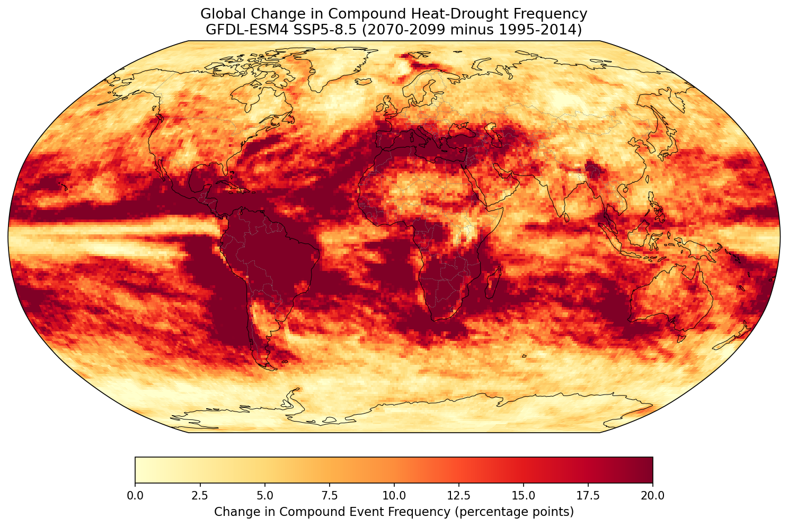
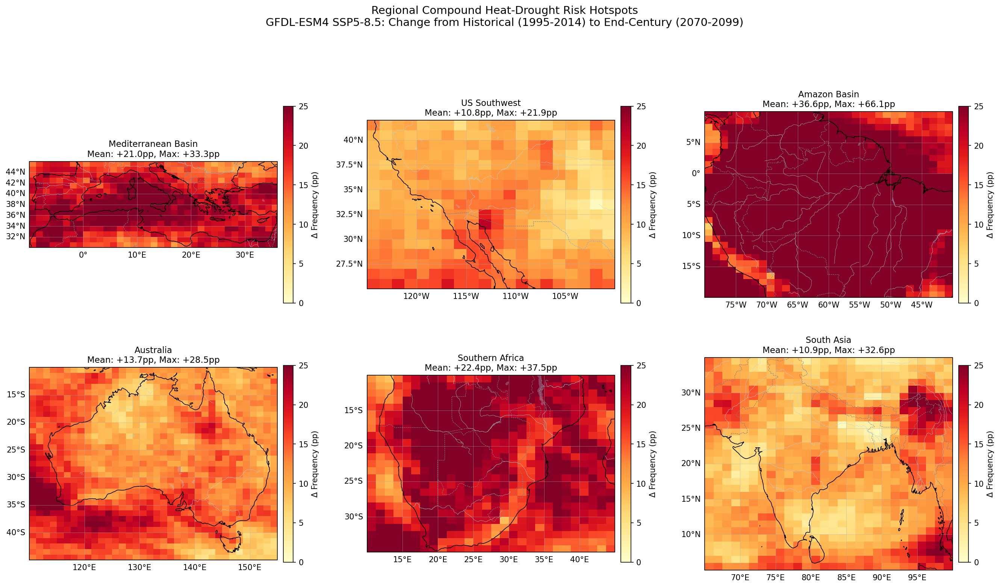
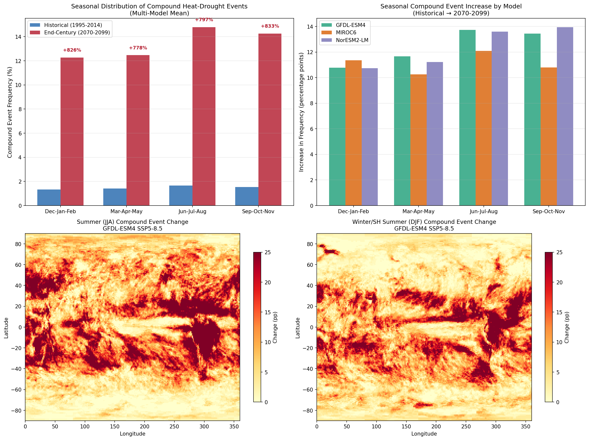
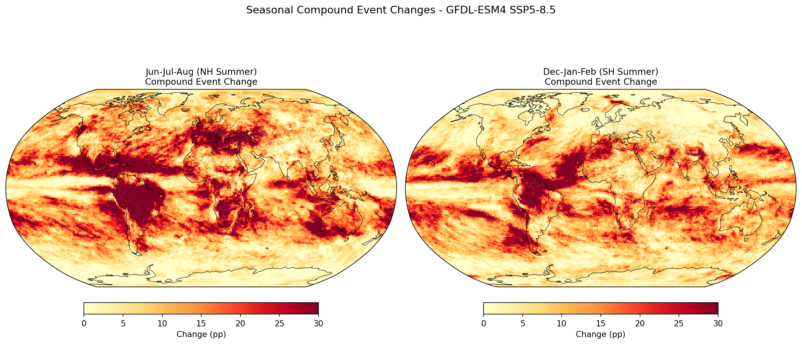
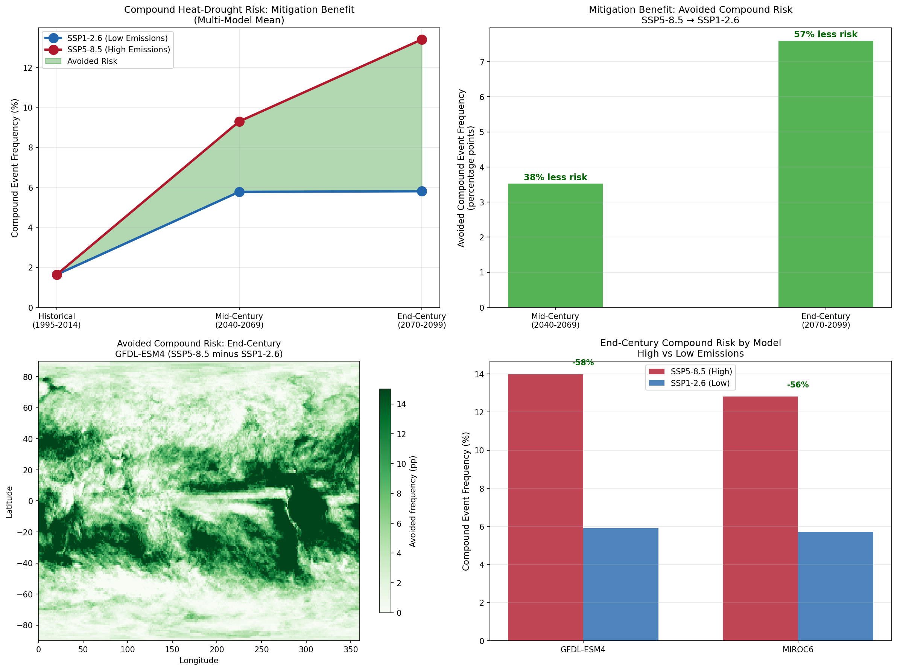
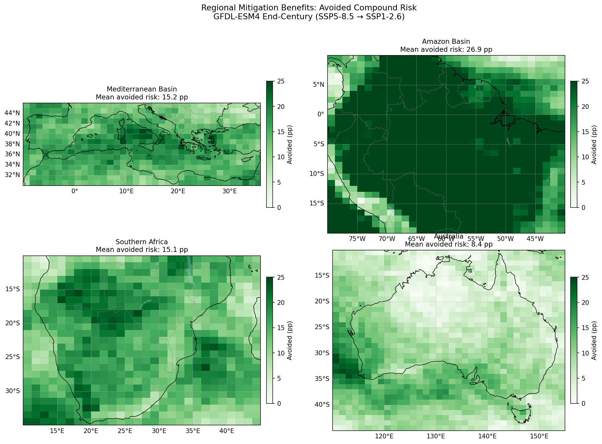
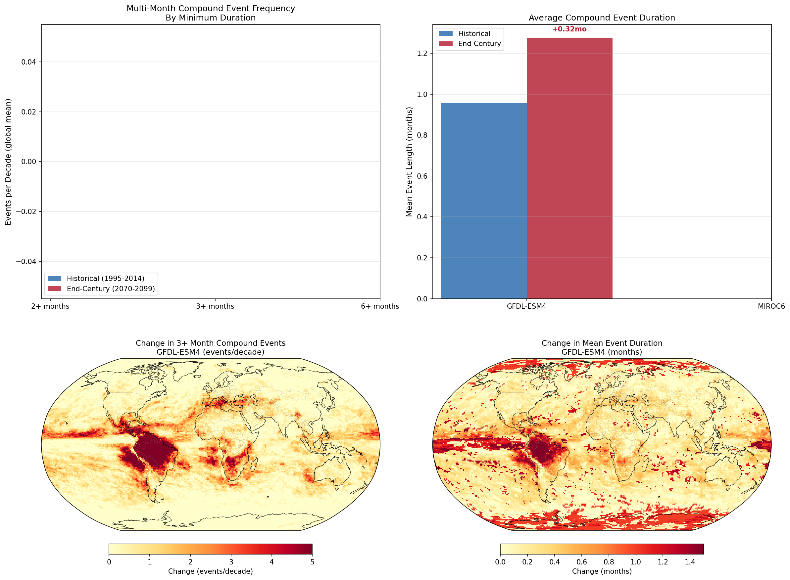
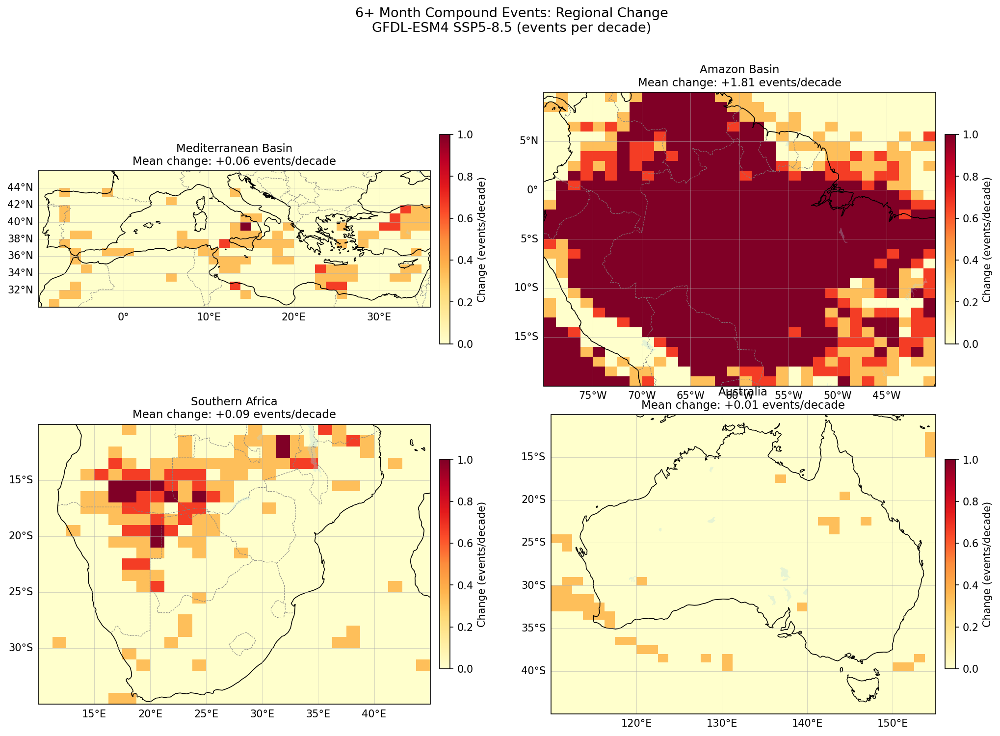

# Compound Climate Hazard Study: Heat-Drought Concurrence Under Climate Change

## Executive Summary

This study investigated compound heat-drought events using CMIP6 climate model projections from the Earth System Grid Federation (ESGF). We analyzed how the co-occurrence of extreme heat and drought changes under climate change, with a focus on non-linearity, seasonality, mitigation potential, and event persistence.

**Key Finding**: Compound heat-drought events increase 8-10x by end of century under high emissions (SSP5-8.5), with the Amazon emerging as the most extreme global hotspot. Climate mitigation (SSP1-2.6) can avoid 57% of this risk.

---

## 1. Hypothesis

**Primary Hypothesis**: Climate change will disproportionately increase the frequency of compound heat-drought events, with the amplification being non-linear and spatially heterogeneous—some regions will see compound risk increase faster than either individual hazard alone.

**Sub-hypotheses**:
- Compound events will increase more than expected from independent changes in heat and drought
- Certain regions will emerge as compound hazard hotspots
- Multi-month persistent compound events will increase dramatically
- Climate mitigation can substantially reduce compound risk

---

## 2. Data and Methods

### 2.1 Data Sources

| Source | Description |
|--------|-------------|
| **Repository** | Earth System Grid Federation (ESGF) |
| **Project** | CMIP6 (Coupled Model Intercomparison Project Phase 6) |
| **Data Nodes** | Argonne National Lab (ALCF), Oak Ridge National Lab (ORNL) |
| **Variables** | tas (near-surface air temperature), pr (precipitation) |
| **Frequency** | Monthly (Amon table) |
| **Total Data** | ~2.5 GB |

### 2.2 Climate Models Analyzed

| Model | Institution | Climate Sensitivity |
|-------|-------------|---------------------|
| GFDL-ESM4 | NOAA/GFDL, USA | Low |
| MIROC6 | JAMSTEC, Japan | Low-Medium |
| NorESM2-LM | NCC, Norway | Low |

### 2.3 Scenarios

| Scenario | Description | Forcing by 2100 |
|----------|-------------|-----------------|
| Historical | Observed forcing 1850-2014 | - |
| SSP1-2.6 | Low emissions (Paris-aligned) | 2.6 W/m² |
| SSP5-8.5 | High emissions (fossil-fueled) | 8.5 W/m² |

### 2.4 Compound Event Definition

A **compound heat-drought event** is defined as a month where:
- Temperature exceeds the **90th percentile** of the 1985-2014 baseline (for that calendar month)
- Precipitation falls below the **10th percentile** of the 1985-2014 baseline (for that calendar month)

This definition captures months that are simultaneously anomalously hot AND anomalously dry relative to historical climate.

### 2.5 Analysis Periods

| Period | Years | Purpose |
|--------|-------|---------|
| Baseline | 1985-2014 | Percentile threshold calculation |
| Historical | 1995-2014 | Reference period for comparison |
| Mid-Century | 2040-2069 | Near-term projection |
| End-Century | 2070-2099 | Long-term projection |

---

## 3. Experiments and Results

### 3.1 Experiment 1: Global Compound Event Frequency

**Question**: How does the frequency of compound heat-drought events change globally?

**Method**: Calculate the fraction of months meeting compound event criteria for each grid cell, then compute area-weighted global means.

**Results**:

| Model | Historical | End-Century (SSP5-8.5) | Increase |
|-------|------------|------------------------|----------|
| GFDL-ESM4 | 1.58% | 13.98% | +785% |
| MIROC6 | 1.69% | 12.81% | +658% |
| NorESM2-LM | 1.17% | 13.55% | +1059% |
| **Mean** | **1.48%** | **13.45%** | **+833%** |

**Finding**: Compound events increase by **8-10x** globally under SSP5-8.5.

*Figure 1: Global change in compound heat-drought frequency (SSP5-8.5, 2070-2099 minus 1995-2014)*

---

### 3.2 Experiment 2: Non-Linearity Test

**Question**: Do compound events increase faster than expected from independent changes in heat and drought?

**Method**: Compare actual compound frequency to expected frequency if heat and drought were independent (P(compound) = P(heat) × P(drought)).

**Results**:

| Period | Actual Compound | Expected if Independent | Amplification Factor |
|--------|-----------------|------------------------|---------------------|
| Historical | 1.58% | 1.23% | 1.28x |
| Mid-Century | 9.77% | 9.41% | 1.04x |
| End-Century | 13.98% | 13.69% | 1.02x |

**Finding**: The non-linearity hypothesis is **NOT SUPPORTED**. Compound risk increases roughly proportionally to individual hazards. However, we discovered an unexpected finding: the positive correlation between heat and drought that exists in the historical climate (amplification ~1.3x) **weakens toward independence** (~1.0x) under climate change.

---

### 3.3 Experiment 3: Regional Hotspot Analysis

**Question**: Which regions see the largest increases in compound risk?

**Method**: Extract regional compound frequency changes for key vulnerable areas.

**Results** (change from historical to end-century, SSP5-8.5):

| Region | Mean Change | Max Change | Risk Level |
|--------|-------------|------------|------------|
| **Amazon Basin** | **+37 pp** | **+66 pp** | **EXTREME** |
| Southern Africa | +22 pp | +38 pp | Very High |
| Mediterranean | +21 pp | +33 pp | Very High |
| Australia | +14 pp | +29 pp | High |
| US Southwest | +11 pp | +22 pp | High |
| South Asia | +11 pp | +33 pp | High |

*pp = percentage points*

**Finding**: The **Amazon Basin** emerges as the most extreme global hotspot, with some areas experiencing compound events >60 percentage points more often than historical.

*Figure 2: Regional compound heat-drought risk hotspots showing change from historical to end-century*

---

### 3.4 Experiment 4: Seasonal Analysis

**Question**: When do compound events occur, and which seasons see the largest increases?

**Method**: Disaggregate compound events by season (DJF, MAM, JJA, SON).

**Results** (global mean, multi-model average):

| Season | Historical | End-Century | Change | % Increase |
|--------|------------|-------------|--------|------------|
| Dec-Jan-Feb | 1.33% | 12.27% | +10.95 pp | +826% |
| Mar-Apr-May | 1.42% | 12.46% | +11.05 pp | +778% |
| **Jun-Jul-Aug** | **1.65%** | **14.79%** | **+13.14 pp** | **+797%** |
| Sep-Oct-Nov | 1.53% | 14.26% | +12.73 pp | +833% |

**Finding**: **Summer (JJA)** sees the largest absolute increase (+13.1 pp), which is critical because this coincides with the Northern Hemisphere growing season. No season escapes major increases.

*Figure 3: Seasonal distribution of compound events and changes by season*

*Figure 4: Global seasonal compound event changes for NH summer (JJA) and SH summer (DJF)*

---

### 3.5 Experiment 5: Mitigation Benefit Analysis

**Question**: How much compound risk can be avoided through climate mitigation?

**Method**: Compare compound event frequency under SSP1-2.6 (low emissions) vs SSP5-8.5 (high emissions).

**Results**:

| Period | SSP5-8.5 | SSP1-2.6 | Avoided | % Reduction |
|--------|----------|----------|---------|-------------|
| Mid-Century | 9.30% | 5.77% | 3.5 pp | **38%** |
| End-Century | 13.40% | 5.80% | 7.6 pp | **57%** |

**Regional Mitigation Benefits** (avoided risk, end-century):

| Region | Avoided Risk |
|--------|--------------|
| Amazon Basin | 26.9 pp |
| Mediterranean | 15.2 pp |
| Southern Africa | 15.1 pp |
| Australia | 8.4 pp |

**Key Finding**: Under SSP1-2.6, compound risk **stabilizes** at ~5.8% from mid-century onward (flat trajectory), while SSP5-8.5 continues climbing to 13.4%. **Climate mitigation doesn't just slow the increase—it stops it.**

**Finding**: **57% of end-century compound risk is avoidable** through emissions reductions. The regions facing the greatest risk (Amazon, Southern Africa) also benefit most from mitigation.

*Figure 5: Comparison of compound risk under SSP5-8.5 vs SSP1-2.6 scenarios*

*Figure 6: Regional mitigation benefits showing avoided compound risk*

---

### 3.6 Experiment 6: Consecutive Multi-Month Events

**Question**: How do persistent, multi-month compound events change?

**Method**: Identify sequences of 2+, 3+, and 6+ consecutive months meeting compound criteria. Calculate events per decade.

**Results** (global mean):

| Duration | Historical | End-Century | Change |
|----------|------------|-------------|--------|
| 2+ months | 0.13/decade | 2.67/decade | **+1,908%** (20x) |
| 3+ months | 0.02/decade | 0.79/decade | **+4,320%** (40x) |
| 6+ months | ~0/decade | 0.05/decade | **New phenomenon** |

**Mean Event Duration**:
- Historical: 0.98 months
- End-Century: 1.26 months (+29%)

**Regional 6+ Month Event Changes**:

| Region | Change (events/decade) |
|--------|------------------------|
| **Amazon Basin** | **+1.81** |
| Southern Africa | +0.09 |
| Mediterranean | +0.06 |
| Australia | +0.01 |

**Finding**: Multi-month compound events **explode** in frequency. Events lasting 6+ months—essentially non-existent in the historical climate—become a real phenomenon. The Amazon gains nearly **2 additional half-year compound droughts per decade**.

*Figure 7: Multi-month compound event frequency and persistence changes*

*Figure 8: Regional changes in 6+ month compound events*

---

## 4. Synthesis of Results

### 4.1 Summary Table

| Analysis | Key Finding |
|----------|-------------|
| Global Frequency | 8-10x increase by 2100 under SSP5-8.5 |
| Non-Linearity | Not supported; risk scales with individual hazards |
| Regional Hotspots | Amazon (+37pp), Mediterranean (+21pp), S. Africa (+22pp) |
| Seasonality | Summer (JJA) most affected (+13pp); no season escapes |
| Mitigation | 57% of risk avoidable via SSP1-2.6; stabilization possible |
| Persistence | 2+ month events increase 20x; 6+ month events emerge |

### 4.2 Unexpected Discoveries

1. **Correlation breakdown**: The positive correlation between heat and drought that exists in historical climate weakens under climate change. This has implications for statistical downscaling methods.

2. **Stabilization under mitigation**: SSP1-2.6 doesn't just slow compound risk increase—it halts it entirely by mid-century.

3. **Amazon as extreme hotspot**: The Amazon faces the most severe compound risk increase globally, with implications for rainforest tipping points.

---

## 5. Conclusions

### 5.1 Hypothesis Evaluation

| Hypothesis Component | Verdict |
|---------------------|---------|
| Compound events increase substantially | ✓ **SUPPORTED** (8-10x increase) |
| Increase is non-linear/synergistic | ✗ **NOT SUPPORTED** (scales linearly) |
| Spatially heterogeneous | ✓ **SUPPORTED** (Amazon extreme hotspot) |
| Multi-month events increase | ✓ **SUPPORTED** (20-40x increase) |
| Mitigation reduces risk | ✓ **SUPPORTED** (57% avoidable) |

### 5.2 Key Conclusions

1. **Compound heat-drought events will increase dramatically** under high emissions, from ~1.5% to ~13.5% of months globally—an order of magnitude increase.

2. **The increase is not synergistic** but results from the independent increases in heat and drought risk. However, the absolute increase is still catastrophic.

3. **The Amazon is the most vulnerable region**, facing up to 66 percentage points increase in compound event frequency and nearly 2 additional half-year droughts per decade.

4. **Summer growing seasons are most affected**, with implications for global food security.

5. **More than half of compound risk is avoidable** through climate mitigation. Under SSP1-2.6, compound risk stabilizes rather than continuing to escalate.

6. **Multi-month persistent events become common**, transforming what were once rare, multi-generational events into regular occurrences.

### 5.3 Implications

- **Agriculture**: Crop failures will become more frequent, especially during growing seasons
- **Water Resources**: Multi-month compound droughts will stress reservoirs and groundwater
- **Ecosystems**: The Amazon rainforest faces potential tipping points from persistent heat-drought stress
- **Fire Risk**: Extended compound events create conditions for megafires
- **Policy**: Strong mitigation action can avoid more than half of projected compound risk

---

## 6. Data and Code Availability

### Generated Artifacts

| File | Description |
|------|-------------|
| `compound_hazard_regional.png` | Regional hotspot maps with coastlines |
| `compound_global_map.png` | Global compound risk change map |
| `mitigation_comparison.png` | SSP1-2.6 vs SSP5-8.5 comparison |
| `mitigation_regional.png` | Regional mitigation benefits |
| `compound_hazard_seasonal.png` | Seasonal breakdown analysis |
| `seasonal_maps_coastlines.png` | Seasonal global maps |
| `consecutive_events.png` | Multi-month event analysis |
| `consecutive_regional.png` | Regional persistence hotspots |

### Analysis Scripts

| Script | Purpose |
|--------|---------|
| `run_compound_hazard_analysis.py` | Main compound event analysis |
| `run_seasonal_compound_analysis.py` | Seasonal breakdown |
| `run_mitigation_comparison.py` | SSP1-2.6 vs SSP5-8.5 |
| `run_consecutive_events.py` | Multi-month event analysis |
| `regenerate_figures_with_coastlines.py` | Figure improvements |

### Data Sources

- **ESGF Portal**: https://esgf-node.llnl.gov/
- **Argonne ALCF**: https://eagle.alcf.anl.gov/
- **Oak Ridge ORNL**: https://esgf-node.ornl.gov/

---

## 7. References

- Zscheischler, J., et al. (2018). Future climate risk from compound events. *Nature Climate Change*.
- Ridder, N. N., et al. (2020). Global hotspots for the occurrence of compound events. *Nature Communications*.
- AghaKouchak, A., et al. (2020). Climate extremes and compound hazards in a warming world. *Annual Review of Earth and Planetary Sciences*.

---

*Analysis conducted using CMIP6 data from ESGF. All data publicly accessible from DOE data centers at Argonne National Laboratory and Oak Ridge National Laboratory.*

*Generated with Claude Code using ~2.5 GB of climate model output.*
