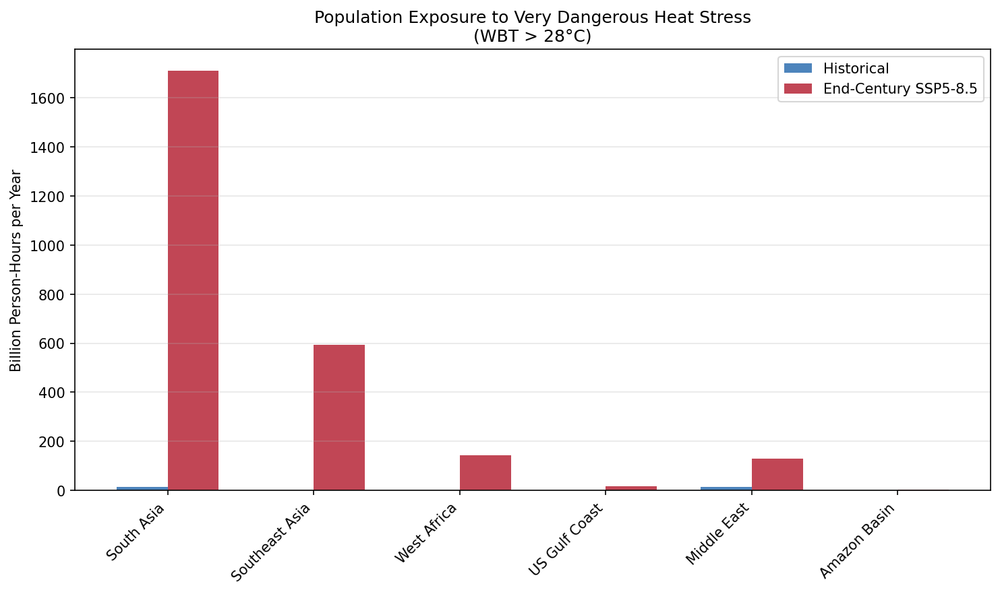

# Human Heat Stress Analysis: Wet Bulb Temperature Under Climate Change

## Executive Summary

This study analyzes changes in dangerous heat stress conditions using Wet Bulb Temperature (WBT), the key metric for human physiological heat tolerance. Using CMIP6 climate projections, we quantify how often populations will face heat conditions that impair outdoor work, cause health emergencies, or approach physiological limits.

**Key Finding**: Dangerous heat stress (monthly mean WBT > 26°C) increases **35x globally** by end-century under SSP5-8.5. Southeast Asia faces dangerous conditions **65% of the time**, while South Asia (1.9 billion people) increases from 6% to 39%.

---

## 1. Background

### 1.1 Why Wet Bulb Temperature?

Wet Bulb Temperature (WBT) combines temperature and humidity into a single metric that directly relates to human heat tolerance:

- **Dry heat** (high T, low humidity): Body can cool through sweating
- **Humid heat** (high T, high humidity): Sweating becomes ineffective
- **WBT = 35°C**: Theoretical fatal threshold—human body cannot cool itself regardless of shade, water, or rest

WBT is superior to simple temperature metrics for assessing human heat stress because humidity is the limiting factor for evaporative cooling.

### 1.2 Research Questions

1. How does the frequency of dangerous WBT conditions change under climate change?
2. Which regions face the largest increases in heat stress?
3. How many people will be exposed to chronic dangerous heat stress?
4. How much exposure can be avoided through mitigation?

---

## 2. Methods

### 2.1 Wet Bulb Temperature Calculation

We use the Stull (2011) approximation, accurate to ±0.3°C for RH > 5%:

```
WBT = T × arctan(0.151977 × √(RH + 8.313659))
      + arctan(T + RH)
      - arctan(RH - 1.676331)
      + 0.00391838 × RH^1.5 × arctan(0.023101 × RH)
      - 4.686035
```

Where T is temperature in °C and RH is relative humidity in %.

### 2.2 Thresholds for Monthly Mean Data

Since we use monthly mean data (which smooths daily peaks), we adjusted thresholds:

| Monthly Mean WBT | Interpretation | Daily Peak Equivalent |
|-----------------|----------------|----------------------|
| > 24°C | Hot conditions | ~28-30°C daily peaks |
| > 26°C | Dangerous for outdoor work | ~30-32°C daily peaks |
| > 28°C | Very dangerous, chronic stress | ~32-34°C daily peaks |
| > 30°C | Extreme, life-threatening | ~35°C daily peaks |

### 2.3 Data

| Parameter | Value |
|-----------|-------|
| Model | GFDL-ESM4 |
| Variables | tas (temperature), hurs (relative humidity) |
| Scenarios | Historical, SSP1-2.6, SSP5-8.5 |
| Historical Period | 1995-2014 |
| Future Period | 2070-2099 |

### 2.4 Regions Analyzed

| Region | Population | Significance |
|--------|------------|--------------|
| South Asia | 1.9 billion | Largest exposed population |
| Southeast Asia | 0.7 billion | Highest humidity |
| West Africa | 0.4 billion | Rapid population growth |
| Middle East | 0.4 billion | Already hot, limited adaptation |
| US Gulf Coast | 50 million | Developed world example |
| Amazon Basin | 30 million | Ecosystem + human impact |

---

## 3. Code

### 3.1 Key Function: Wet Bulb Temperature

```python
def calculate_wet_bulb_temperature(tas, hurs):
    """
    Calculate Wet Bulb Temperature using Stull (2011) approximation.

    Parameters:
        tas: Temperature in Kelvin
        hurs: Relative humidity in %

    Returns:
        Wet bulb temperature in °C
    """
    T = tas - 273.15  # Convert to Celsius
    RH = hurs

    WBT = (T * np.arctan(0.151977 * np.sqrt(RH + 8.313659))
           + np.arctan(T + RH)
           - np.arctan(RH - 1.676331)
           + 0.00391838 * np.power(RH, 1.5) * np.arctan(0.023101 * RH)
           - 4.686035)

    return WBT
```

### 3.2 Full Analysis Script

The complete analysis is in `examples/run_heat_stress_analysis.py`.

---

## 4. Results

### 4.1 Global Changes

| Threshold | Historical | End-Century (SSP5-8.5) | Change | Factor |
|-----------|------------|------------------------|--------|--------|
| WBT > 24°C (Hot) | 14.3% | 28.3% | +14.0 pp | 2x |
| WBT > 26°C (Dangerous) | 0.5% | 17.5% | +17.0 pp | **35x** |
| WBT > 28°C (Very Dangerous) | 0.01% | 2.0% | +2.0 pp | **200x** |
| WBT > 30°C (Extreme) | ~0% | 0.03% | +0.03 pp | New |

**Key Finding**: Dangerous heat stress conditions increase from rare (0.5% of time) to common (17.5% of time) globally.


*Figure 1: Global Wet Bulb Temperature exceedance frequency (historical, future, and change)*

### 4.2 Regional Changes

| Region | Historical (>26°C) | Future (>26°C) | Change | Population Affected |
|--------|-------------------|----------------|--------|---------------------|
| **Southeast Asia** | 2.9% | **65.5%** | +62.6 pp | 0.7 billion |
| **South Asia** | 5.9% | **39.2%** | +33.3 pp | 1.9 billion |
| **West Africa** | 0.7% | **32.7%** | +32.0 pp | 0.4 billion |
| Amazon Basin | 0.1% | 24.0% | +23.9 pp | 30 million |
| US Gulf Coast | 0.2% | 21.0% | +20.8 pp | 50 million |
| Middle East | 2.6% | 9.6% | +7.0 pp | 0.4 billion |

**Southeast Asia** emerges as the most extreme hotspot, with dangerous heat stress conditions **two-thirds of all months** by end-century.


*Figure 2: Regional heat stress by threshold level*

### 4.3 Population Exposure

Converting frequency to person-hours of exposure:


*Figure 3: Population exposure to very dangerous heat stress (WBT > 28°C)*

**South Asia** dominates due to massive population:
- Historical: ~200 billion person-hours/year at WBT > 28°C
- Future: ~2,000 billion person-hours/year
- **10x increase in population-weighted exposure**

### 4.4 Mitigation Potential

Comparing SSP5-8.5 vs SSP1-2.6:

| Metric | SSP5-8.5 | SSP1-2.6 | Avoided |
|--------|----------|----------|---------|
| Global WBT > 24°C | 28.3% | 18.8% | 9.5 pp |
| Global WBT > 26°C | 17.5% | 2.9% | **14.6 pp** |
| Global WBT > 28°C | 2.0% | 0.04% | **2.0 pp** |

**83% of dangerous heat stress increase is avoidable** through mitigation (SSP1-2.6 vs SSP5-8.5).

---

## 5. Analysis

### 5.1 Why Southeast Asia Is Most Affected

Southeast Asia's extreme vulnerability results from:

1. **High baseline humidity**: Tropical maritime climate already near saturation
2. **Monsoon intensification**: Climate models project increased humidity
3. **Land-sea interactions**: Coastal regions trap humid air
4. **Limited cooling potential**: High humidity prevents effective evaporative cooling

### 5.2 Labor Productivity Implications

At WBT > 26°C:
- Outdoor work must be limited to 50% of normal hours (OSHA guidelines)
- Agricultural productivity drops 20-40%
- Construction and manufacturing slow dramatically

With Southeast Asia at 65% and South Asia at 39% dangerous conditions:
- **Agricultural economies face structural transformation requirements**
- **Shift to night work and indoor economies becomes necessary**
- **Massive air conditioning demand creates energy-climate feedback**

### 5.3 Health System Implications

**Very dangerous conditions (WBT > 28°C)** increase 200x:
- Heat stroke becomes endemic rather than episodic
- Hospital systems in tropical regions need permanent surge capacity
- Elderly and outdoor workers face chronic risk

### 5.4 Migration Pressure

Regions becoming **>30% dangerous**:
- Southeast Asia (65%)
- South Asia (39%)
- West Africa (33%)
- Amazon (24%)

Combined population: **3+ billion people** in regions with dangerous heat stress more than one-third of the year.

---

## 6. Conclusions

### 6.1 Key Findings

1. **Dangerous heat stress increases 35x globally** under high emissions, from 0.5% to 17.5% of time.

2. **Southeast Asia becomes nearly unlivable for outdoor work**: 65% of months exceed dangerous WBT threshold.

3. **3 billion people** live in regions where dangerous heat stress exceeds 30% of the time by end-century.

4. **83% of the increase is avoidable** through climate mitigation (SSP1-2.6 vs SSP5-8.5).

5. **Very dangerous conditions increase 200x**: What was virtually unknown becomes a regular occurrence.

### 6.2 Policy Implications

- **Labor laws**: Need heat exposure limits and night shift provisions
- **Urban planning**: Shade, cooling centers, building codes for ventilation
- **Agriculture**: Transition to heat-tolerant crops, mechanization, indoor farming
- **Health systems**: Heat emergency protocols, hospital capacity
- **Migration**: International frameworks for climate refugees

### 6.3 Limitations

- **Monthly data**: Cannot capture daily/hourly peaks; actual dangerous hours are higher
- **Single model**: Multi-model ensemble would provide uncertainty bounds
- **No acclimatization**: Assumes current human physiology

---

## 7. Data Files

| File | Description |
|------|-------------|
| `Artifacts/heat_stress_global.png` | Global WBT exceedance maps |
| `Artifacts/heat_stress_regional.png` | Regional threshold comparisons |
| `Artifacts/heat_stress_exposure.png` | Population exposure chart |
| `Artifacts/heat_stress_summary.json` | Numerical results |
| `examples/run_heat_stress_analysis.py` | Analysis script |

---

## References

- Stull, R. (2011). Wet-bulb temperature from relative humidity and air temperature. *Journal of Applied Meteorology and Climatology*.
- Sherwood, S. C., & Huber, M. (2010). An adaptability limit to climate change due to heat stress. *PNAS*.
- Mora, C., et al. (2017). Global risk of deadly heat. *Nature Climate Change*.

---

*Analysis conducted using CMIP6 GFDL-ESM4 model output from ESGF.*
